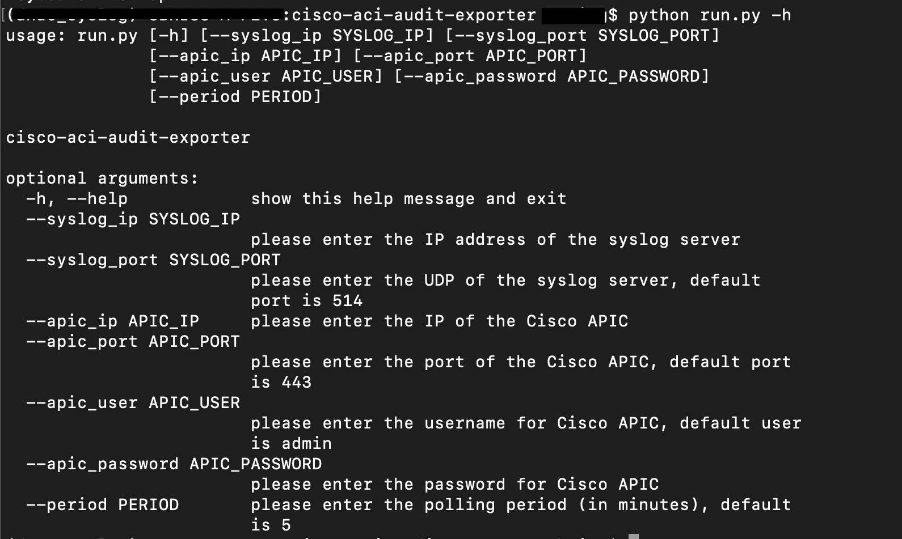
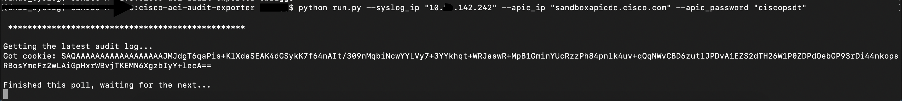
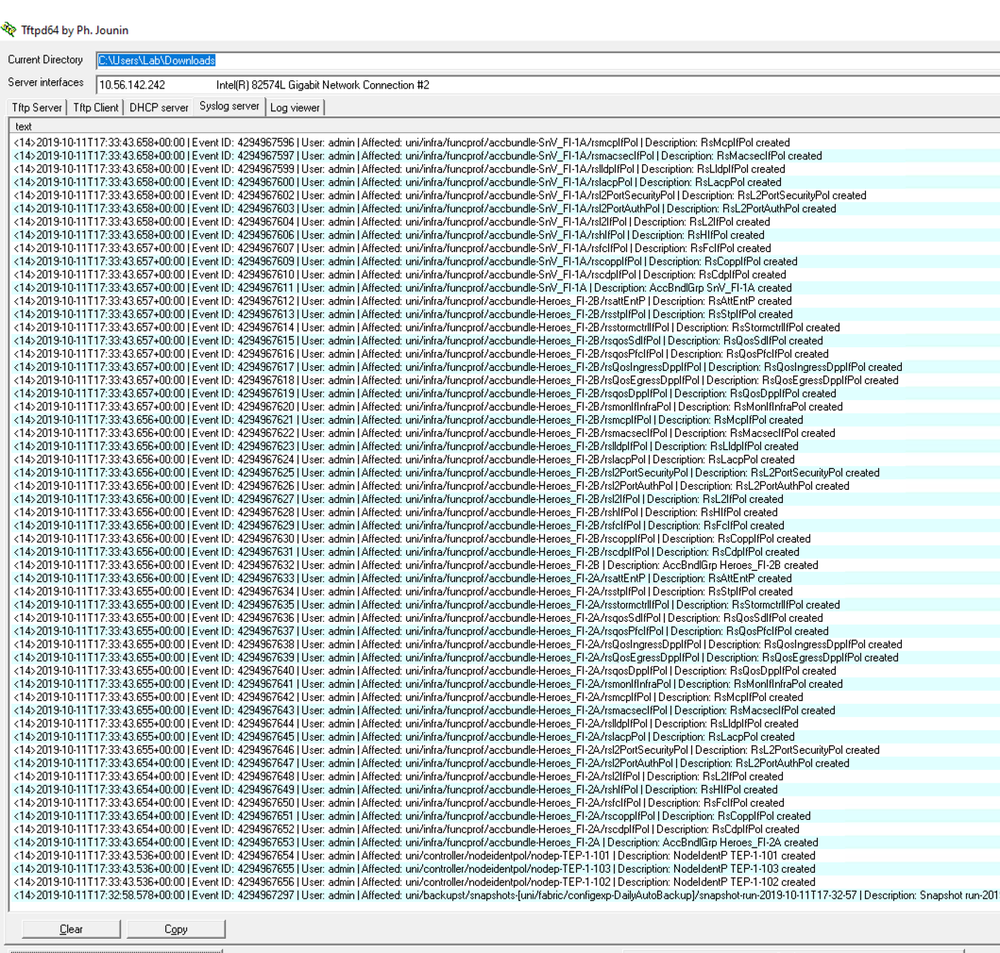

# Cisco ACI Audit Exporter
This simple code will pull Cisco ACI's audit log every [defined period of time], in order to export it to an external program/platform.
Initial version support export via syslog, later additional exporters will be added.
* Technology stack: Python + Docker (optional)
* Status:  Alpha, designed to prove the ability and openess of Cisco ACI.
* Screenshot:

    Help screen:
<p align="center">

</p>
    Example run (using [DevNet's alway-on ACI simulator](https://developer.cisco.com/site/sandbox/)):
<p align="center">

</p>
    Example result (on a Windows machine running a freeware syslog server):
<p align="center">

</p>

## Use Case Description

Even though Cisco ACI is a cutting edge solution, some of our customers are using existing monitoring and SIEM systems that use legacy protocols. In this case - syslog.
As Cisco ACI is not designed to export its audit log via syslog - this code bridges that gap, allowing the customer to leverage existing syslog-based SIEM solution.

## How to setup
```
docker run -d obrigg/cisco-aci-audit-exporter --apic_ip "APIC-CLUSTER-IP" --apic_password "APIC-PASSWORD" --syslog_ip "SYSLOG-SERVER-IP"
```
### Mandatory Arguments:
* --apic_ip: The IP address/FQDN for the Cisco APIC.
* --apic_password: Password for Cisco APIC.
* --syslog_ip: The IP address of the syslog server.

### Optional Arguments:
* --apic_port: If different than 443.
* --apic_user: If different than "admin".
* --syslog_port: If different than 514.
* --period: pulling time, if different than 5 minutes.

## Licensing info
Copyright (c) 2019 Cisco and/or its affiliates.

This software is licensed to you under the terms of the Cisco Sample
Code License, Version 1.1 (the "License"). You may obtain a copy of the
License at

               https://developer.cisco.com/docs/licenses

All use of the material herein must be in accordance with the terms of
the License. All rights not expressly granted by the License are
reserved. Unless required by applicable law or agreed to separately in
writing, software distributed under the License is distributed on an "AS
IS" BASIS, WITHOUT WARRANTIES OR CONDITIONS OF ANY KIND, either express
or implied.

## Recognition
Robert Csapo - for helping getting the code started.
Christopher Paggen - for helping with the initial ACI API calls.
